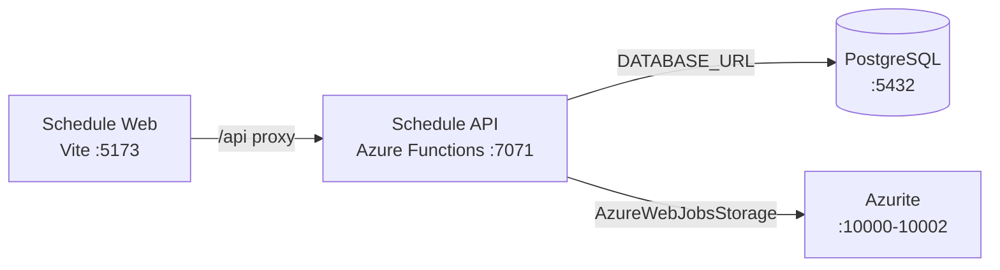

# Azure Debug Plan

> This plan is the source of truth for generating the
> VS Code debug setup in this workspace.
>
> **Status:** Implemented
> **Execution Mode:** Guided
> **Created:** 2026-09-28T17:57:04+05:30
> **Last Updated:** 2026-09-28T18:55:00+05:30
>
> <!-- Guided Mode (default) - review and approve before generating. -->

---

## Prerequisites

| Tool / Extension | Category | Service(s) | Installed | Version |
|------------------|----------|------------|-----------|---------|
| Node.js | Runtime | * | ✅ | v24.21.0 |
| npm | Package manager | * | ✅ | 12.0.2 |
| Azure Functions Core Tools | Runtime | schedule-api | ✅ | 4.15.1 |
| Docker | Container runtime | schedule-api | ✅ | 29.8.0 |
| Docker Compose | Compose provider | schedule-api | ✅ | v5.5.1 |
| Chrome | Browser | schedule-web | ✅ | — |
| `ms-azuretools.vscode-azurefunctions` | VS Code extension | schedule-api | ✅ | 1.22.2 |

---

## Debug Configurations

Each checked row below produces a VS Code debug configuration in `.vscode/launch.json`.

| Generate | Debug Config Name | Service Label | Service Root | Project Type | Runtime | Version | Azure Dependencies |
|----------|--------------------|---------------|--------------|--------------|---------|---------|---------------------|
| [x] | Schedule API (debug) | Schedule API | `./services/schedule-api` | functions | node-ts | 24.21.0 | Azure Storage, PostgreSQL |
| [x] | Schedule Web (debug) | Schedule Web | `./services/schedule-web` | frontend-spa | node-ts | 24.21.0 | — |
| [x] | Debug All Services | Debug All Services |  | *Compound Config* |  |  |  |

Project Type Descriptions

| Project Type | Description |
|-------------|-------------|
| functions | Azure Functions serverless API with HTTP triggers and bindings |
| frontend-spa | Vite-served React single-page application |

> Proxy detected: Schedule Web proxies `/api` requests to Schedule API at `http://localhost:7071`; start the API before the web app in the compound configuration.
>
> Existing `.vscode/launch.json` and `.vscode/tasks.json` are partial and must be extended, not replaced wholesale. The current Functions task invokes `npm run watch`, but `services/schedule-api/package.json` has no `watch` script; repair that task chain while preserving the existing attach configuration and unrelated tasks.

---

## Orchestrator

The checked-in `docker-compose.yml` already defines PostgreSQL and Azurite. Docker Desktop and its Compose provider are ready, and the existing Docker-based setup will be retained.

| Orchestrator | Container Runtime | Compose Command | Description |
|-------------|-------------------|-----------------|-------------|
| Docker Compose | Docker | `docker compose` | Runs the existing PostgreSQL and Azurite emulator services for local debugging. |

---

## Emulators

| Dependent Service | Emulator | Purpose |
|-------------------|----------|---------|
| Azure Storage | Azurite Container | Local Blob Storage endpoint used by Azure Functions host storage settings. |
| PostgreSQL | PostgreSQL Container | Local relational database for accounts, goals, commitments, and schedules. |

---

## Architecture Diagram

The Vite frontend proxies API requests to the Azure Functions host, which uses the local PostgreSQL database and Azurite storage emulator.

---

## Migrations

When selected, the generation phase creates an automated VS Code task to apply migrations before the API starts debugging. The API already registers `db:migrate` using `node-pg-migrate`, and migration files are present under `services/schedule-api/migrations/`.

| Generate | Service | Migration Tool |
|----------|---------|----------------|
| [x] | Schedule API | node-pg-migrate (`npm run db:migrate`) |

---

## API Test Collections

When selected, the generation phase produces runnable HTTP smoke tests for the local API.

| Generate | Service | Description |
|----------|---------|-------------|
| [x] | Schedule API | 

HTTP Endpoints (17)
 GET /api/health POST /api/auth/register POST /api/auth/login GET /api/auth/me GET /api/schedule/current PUT /api/schedule/current POST /api/schedule/generate GET /api/goals POST /api/goals PATCH /api/goals/{goalId} DELETE /api/goals/{goalId} GET /api/commitments POST /api/commitments PUT /api/commitments/{commitmentId} DELETE /api/commitments/{commitmentId} GET /api/openapi.json GET /api/openapi.yaml  
 |

---

## Convenience Scripts

These scripts are intended to be added to the root `package.json` while preserving its existing workspace and build scripts.

| Generate | Script | Registered In | Description |
|----------|--------|---------------|-------------|
| [x] | emulators:start | `./package.json` | Start the existing PostgreSQL and Azurite services with Docker Compose, preserving emulator data. |
| [x] | emulators:stop | `./package.json` | Stop the PostgreSQL and Azurite containers without deleting their data volumes. |

## Debug Configuration Checklist

Debug Configuration Checklist:
✅ Schedule API (debug) — Functions host emitted `Host lock lease acquired`; `GET /api/health` returned `200`; Node inspector `9229` was reachable.
✅ Schedule Web (debug) — Vite emitted `Local:`; `GET /` returned `200`.
✅ Debug All Services — Compound startup ran the API first and the web service second; each service started once, both reached readiness, and API/web returned `200`.

Validation note: final teardown released ports `7071`, `5173`, `9229`, `10000`, `10001`, and `10002`. PostgreSQL is mapped to host port `5433` because the pre-existing host PostgreSQL process on `5432` (PID `6140`) was intentionally preserved.